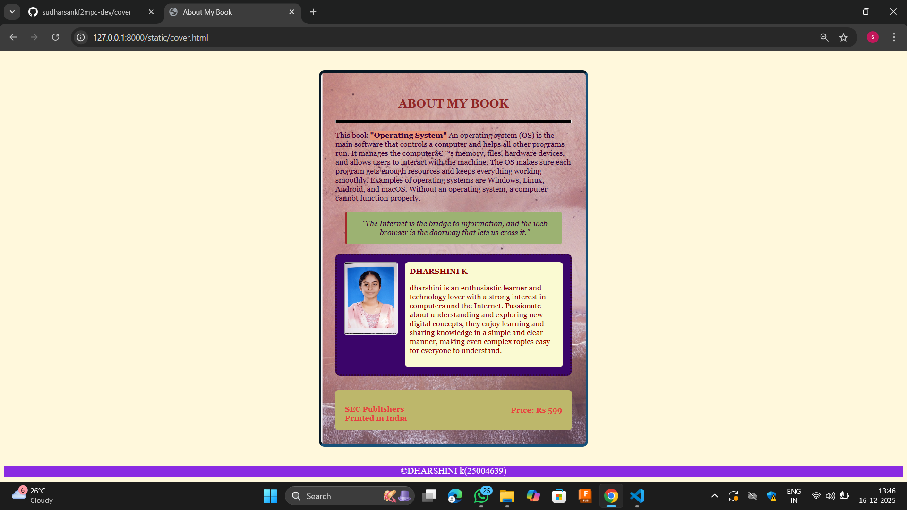

# Ex.05 Book Cover Page Design
## Date: 16-12-2025

## AIM:
To design a book back cover page using HTML and CSS.

## DESIGN STEPS:

### Step 1:
Create a Django Admin project.

### Step 2:
Create an app in the Django interface.

### Step 3:
Create a folder named 'static' in the app folder.

### Step 4:
Create a new HTML file in the static folder.

### Step 5:
Write the HTML code with relevant CSS properties.

### Step 6:
Choose the appropriate style and color scheme.

### Step 7:
Insert the images in their appropriate places.

### Step 8:
Publish the website in the LocalHost.

## PROGRAM:
```
cover.html

<html>
<head>
    <title>About My Book</title>
    <link href=styles.css rel="stylesheet">
</head>
<body>

<div class="box">

    <h2>ABOUT MY BOOK</h2>
    <hr>

    <p>
        This book <span class="highlight">"Operating System"</span> An operating system (OS) is the main software that controls a computer and helps all other programs run. It manages the computer’s memory, files, hardware devices, and allows users to interact with the machine. The OS makes sure each program gets enough resources and keeps everything working smoothly. Examples of operating systems are Windows, Linux, Android, and macOS. Without an operating system, a computer cannot function properly.
    </p>

    <div class="quote">
        "The Internet is the bridge to information, and the web browser is the doorway that lets us cross it."
    </div>

    <div class="author">
        
        <div class="authorinfo">
            <b>DHARSHINI K</b>
            <p>dharshini is an enthusiastic learner and technology lover with a strong interest in computers and the Internet. Passionate about understanding and exploring new digital concepts, they enjoy learning and sharing knowledge in a simple and clear manner, making even complex topics easy for everyone to understand.</p>
        </div>
    </div>

    <div class="bottom"><br>
        SEC Publishers
        <br>
        Printed in India
        <h4 style="text-align:right;">Price: Rs 599</h4>
    </div>
</div>
</body>
<footer>
    <p>&copy;DHARSHINI k(25004639)</p>
</footer>
</html>

styles.css

body
{
    background-color: cornsilk;
}

.box
{
    width: 500px;
     background-image:url(1.png);
    color:rgb(53, 3, 53);
    font-family: Georgia, 'Times New Roman', Times, serif;
    background-size: cover;
    background-position: center;
    border: inset 5px rgb(23, 80, 120);
    border-radius: 12px;
    padding: 30px;
    margin: 40px auto;
}
hr
{
    height: 5px;
    background-color: black;
}
h2
{
    color:rgb(145, 37, 37);
    text-align: center;
    font-size: 25px;
}

.highlight
{
    background-color:darksalmon;
    font-weight: bold;
}

.quote
{
    background-color:rgb(156, 178, 114) ; ;
    padding: 15px;
    border-left: 5px solid brown;
    text-align: center;
    font-style: italic;
    margin: 20px ;
    border-radius: 5px;
}

.author
{
    display: flex;
    gap: 15px;
    background-color:rgb(59, 5, 106);
    padding: 15px;
    border: dotted 3px;
    border-radius: 10px;
    margin-top: 20px;
}

.authorimg
{
    width: 110px;
    height: 150px;
    border: inset 2px;
    border-radius: 5px;
    object-fit: cover;
}

.authorinfo
{
    flex: 1;
    background-color: lightgoldenrodyellow;
    color: darkred;
    padding: 10px;
    border-radius: 8px;
}

.bottom
{
    margin-top: 30px;
    background-color: darkkhaki;
    color: rgb(232, 63, 63);
    padding: 12px 20px;
    border-top: 50px;
    border-radius: 6px;
    font-weight: bold;
    display: flex;
    justify-content: space-between;
}
footer
{
    background-color: blueviolet;
    text-align: center;
    color: white;
    height: 25px;
    font-size: larger;
}
```


## OUTPUT:


## RESULT:
The program for designing book back cover page using HTML and CSS is completed successfully.
